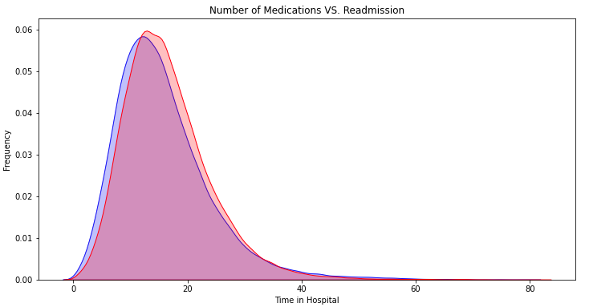

from IPython.display import Image

## Executive Summary 

It was reported that in 2011 more than 3.3 million patients were readmitted in US hospitals within 30 days of being discharged, and they were associated with about $41 billion in hospital costs. The readmission rate has become an essential metric measuring the overall quality of a hospital. The need for readmission indicates that inadequate care was provided to the patient at the time of first admission. Understanding why a patient returns to the hospital after discharge is imperative to preventing readmissions and addressing the challenges of follow-up care. 

Diabetes is well known to be pervasive and has increasingly consumed a large percentage of national health care costs. Therefore, it is increasingly important for medical practitioners to be able to treat diabetes effectively. Diabetes affects nearly every specialty and subspecialty of medical practice; even physicians who are not primary care providers need to be aware of potential complications and comorbidities caused by diabetes. Timely identification of patients facing a high risk of readmission can enable medical practitioners to perform additional examinations and possibly prevent future readmissions. 

According to the American Diabetes Association (ADA), the economic impact of diabetes is significant. In 2007, it was estimated that the direct economic cost of diabetes for the people who have the disease in the United States was estimated to be $116 billion. When one considers the indirect costs of diabetes, such as loss of productivity, disability, and early mortality, the cost is even higher, approaching $174 billion in 2007.

In this project, the data I obtained represents 100,000+ unique inpatient diabetes encounters (medical visits) over 10 years (1999–2008) of clinical care at 130 hospitals and integrated delivery networks in the United States. Using this data, I build a machine learning binary classification model to predict diabetes patients with a high risk of readmission. Note that higher sensitivity (recall) is more beneficial for medical practitioners because it is more crucial to correctly identify "high risk" patients who are likely to be readmitted than identifying "low risk" patients.

Optimizing for sensitivity, the random forest classification model performed best with an accuracy score of 0.62 and sensitivity score of 0.52, respectively. Identification of readmission was consistently lower in all three models when features were limited to what I derived as 10 most important features, using a decision tree classifier. 

## Introduction 

In its simplest explanation, according to the Center for Disease Control and Prevention (CDC, “diabetes is a chronic (long-lasting) health condition that affects how your body turns food into energy”. Diabetes has become a major cause of morbidity and mortality in the United States over the past several decades and is increasing in the rest of the world. Classifying diabetes has been a difficult task. Diabetes is a heterogeneous group of diseases that, through various mechanisms, cause hyperglycemia, commonly known as high blood sugar, a buildup of glucose in a person's bloodstream at dangerously high levels due to a person's body not being able to produce enough insulin in order to regulate the levels within the bloodstream. Amongst other procedures the measurement of a persons’ blood sugar levels is a common method of identifying the disease. Although there have been 50+ types of diabetes detected, the most common types are Type 1; a complete lack of insulin in one’s body, Type 2;  insulin is produced but not utilized correctly,  and Gestational Diabetes; diabetes that pregnant women develop during their pregnancy. 

The dataset I obtained, initially had 50 features, as a binary classification problem, I was interested in the instance of readmission of a patient after their initial "encounter" (medical visit), based on varying features such as age, gender, primary diagnosis, time spent at the hospital during the initial encounter, etc.    

   
   
## Problem Statement 
Do note that the raw data contained over 100 features, more than twice the number of features  available in the data set I obtained. With that in mind, my analysis aimed to determine the following:

1. What factors are the strongest indicators of hospital readmission for a diabetic patient?
2. How well can I predict hospital readmission with "limited" features in this dataset? 

## Dataset 

The dataset represents 10 years (1999-2008) of clinical care at 130 US hospitals and integrated delivery networks throughout the United States: Midwest (18 hospitals), Northeast (58), South (28), and West (16). It includes over 50 features representing patient and hospital outcomes. Information was extracted from the database for encounters that satisfied the following criteria:

* It is an inpatient encounter (a hospital admission).
* It is a diabetic encounter, that is, one during which any kind of diabetes was entered to the system as a diagnosis.
* The length of stay was at least 1 day and at most 14 days.
* Laboratory tests were performed during the encounter.
* Medications were administered during the encounter.
* The data contains such attributes as patient number, race, gender, age, admission type, time in hospital, medical specialty of admitting physician, number of lab test performed, HbA1c test result, diagnosis, number of medications, diabetic medications, number of outpatient, inpatient, and emergency visits in the year before the hospitalization, etc. For a full list of attributes and their descriptions, [click here](https://www.hindawi.com/journals/bmri/2014/781670/tab1/)

## Cleaning 

Prior to cleaning my dataset had 101,766 observations and 50 features including the target feature, readmission of patients after discharge. 

* Features/variables with more than 40% of their data missing, immediately got dropped:
   - Weight
   - Payer code
   - Medical specialty 

* Features/variables with 2% or less of their data missing, I dropped the corresponding rows:
   - race
   - diag_1 - primary diagnoses
   - diag_2 - secondary diagnosis
   - diag_3 - additional diagnosis

A greater percentage of the variables in this data set had the same criteria so learning to apply code to change data types in order to perform EDA, was my biggest challenge within the cleaning process. Learning the necessary coded to clean these helped me grow in terms of coding efficiency.  

After my initial cleaning steps I had cut the datatset to 98,052 and 48 features target variable feature to conduct EDA upon. 

## Explorartory Data Analysis
 

Let’s take a look at some of the results from EDA 

### Target Feature 

* 0: 53% of patients were not readmitted to a hospital after discharge discharge. 
* 1: 47% of patients were readmitted to hosipital after discharge. 

### Demographics

* 48 % of patients readmitted are between 60-80 years of age.  
* 53 % of readmitted patients are females. 
* 76% of readmitted patients are Caucasian.

### Diagnosis

There were a number of features to explore in the dataset but what was most striking to me was the primary diagnosis data. As mentioned earlier it’s key that a timely diagnosis is made by medical practitioners to help identify high risk patients and inturn reduce the occurrence of readmittance. The graph displayed provides an interesting story. When we take a look at it, it's surprising to note that diabetes itself does not lead the way in terms of primary diagnosis. In fact it is the least diagnosed. Instead patients are primarily diagnosed with a circulatory disease, such as  heart attacks, high-blood pressure,chest pains, and high cholesterol. 

### Addressing Outliers

__Lab Procedures Performed__

On average 43 lab tests were performed during a patient's initial admission with a max of 132 performed, for a lay person that seems like a lot of procedures to perform on one patient. So I decided to take a look at outliers, doing so indicated that anything past 96 lab procedures was outside the the threshold. I removed outliers and looked to see the relationship with readmission rates, as you can see from the graph you can see a more uniform distribution and one that mirrors the readmission rates, indicating a stronger correlation to the target variable. 

__Number of Medication__

The initail model was skewed to the left so I decided to delve deeper into this feature. On average 16 distinct generic types of medication were administered to the patient during their initial admission. A maximum of 81 distinct types of medication were administered which I also deemd to be a large amount for one patient and possibly not the norm, since that is big jump from the average. A look at the outliers indicated that anything past 33 distinct types of medications falls out of the upper limit.
Once removed, as you can see from the graph you can see a more uniform distribution and one that mirrors the readmission rates.  

After cleaning and model processing I was left with 94,620 observations and 33 features to perform model testing and training. 

## Modeling and Evaluation 

Three classification models were used: Regression, K-Nearest Neighbors, Random Forest. A baseline score of 0.47 was established.

For each of the models I used these various methods to arrive at the best accuracy and sensivity/ recall socre as posiible.:

1. Deterining and using just the Most Important Features Using a Decision Tree

2. Using principal Component Analysis
3. Levarageing GridSearchCV and fine tuning paramenters to each of teh model.

The results are consolidated in the table below. 
 
 |No.|Model|R2 Training Score|R2 Testing Score|Accuracy|Recall/Sensitivity Score|Comments|
 |---|-----|:---------------:|:--------------:|:------:|:----------------------:|:------:|
 |1|Logistic Regression|0.6184|0.6180|0.6181|0.4336|Higher than baseline but not very high results|
 |2|KNN|0.7202|0.5586|0.5632|0.4336|Expected that the testing score would be higher than testing score, since KNN models commonly over-fit. Accuracy score lower than baseline score of 0.4680|
 |3|Random Forest|0.9999|0.6218|0.6181|0.5151|Same accuracy scores as the logistic regression model.|
 |4|Logistic w/ Important Features|0.6090|0.6093|0.6083|-|All my scores compared to the initial model decrease|
 |5|KNN w/ Important Features|0.7170|0.5642|0.5603|-|Slight in improvement in accuracy score compared to the initial KNN model|
 |6|Random Forest w/ Important Features|0.9998|0.5973|0.5930|-|Decrease in accuracy score compared to the original random forest model.|
 |7|Logistic Regression w/ PCA|-|-|-|0.5512|Out all the logistic model variations, this produced the lowest accuracy score|
 |8|KNN w/ PCA|-|-|-|0.5195|Although not the lowest accuracy score out all the KNN model variations, the score did decrease in comparison to the  KNN model with limited features.|
 |9|Random Forest w/PCA|-|-|-|0.5166|Although not the lowest accuracy score out all the random forest model variations, the score did decrease in comparison to the random forest model with limited features.|
 |10|Logistic Regression w/Grid Search|0.6089|0.6093|0.6087|0.3866||
 |11|KNN w/ Grid Search|0.7708|-|-||0.5195|
 |12|Random Forest w/Grid Search|-|-|-|0.5166|

 
 
    
## Findings and Conclusions

* Ten major features are found to have high impact on diabetes patient readmission: number of lab test performed per patient, the number of procedures apart from lab tests conduct, number of medications administered, time a patient spends in the hospital, primary diagnosis, secondary diagnosis, additional diagnosis, total number of diagnoses entered into the system, age, and the number of inpatient visits in the year preceding the encounter.

    - Although not the best scores, still beneficial for medical practitioners to pay attention to these
    features

* Using Grid Search, the Random Forest Classifier achieved a 0.62 accuracy score and 0.52 sensitivity/recall score. 

## Next Steps 

* In terms of next steps, since my classification models were not quite as good at differentiating readmissions, I would like to attempt other classification models to properly distinguish readmission occurrence. 
* The scope of thw data is from 1999-2008, so I'd be intereted in fining more recent dtata, if avaiilable and taking similar steps to see if there are any improvement in the my model sucess rates. 
* The inclusion of more features would most likely be required since I had stripped my features to just slightly more than 30 features which I believe was the cause of the consistent underperformance of my three models for identifying patient readmission. Maybe additional data such as family history  may need to be included to a dataset such as this. In a lot of medical cases, family history seems to play a major role in diagnosing patients especially with heredity diseases, such as Type 2 diabetes in this case. * A predicatble as this may be, but given the current COVID pandemic, I’d be interested in exploring how this past 2 years have affected readmission rates.

## References 

[1] Center for Disease Control and prevention (2021),"Diabtes Basics.", https://www.cdc.gov/diabetes/basics/getting-tested.html

[2] Fowler, J. Michael, MD, (2010), "Diabetes: Magnitude and Mechanisms.", https://clinical.diabetesjournals.org/content/28/1/42

[3] LaPointe, Jacqueline, (2018), "3 Strategies to Reduce Hospital Readmission Rates, Costs: _Identifying causes, enhancing transitional care, and engaging patients are three ways that hospitals can reduce hospital readmission rates and avoid penalties."_, https://revcycleintelligence.com/news/3-strategies-to-reduce-hospital-readmission-rates-costs

[4] Strack, Beata, et al.,  (2014), "Impact of HbA1c measurement on hospital readmission rates: analysis of 70,000 clinical database patient records." BioMed research international 2014, https://www.hindawi.com/journals/bmri/2014/781670/

[5] "UCI Machine Learning Repository", (2014), https://archive.ics.uci.edu/ml/datasets/Diabetes+130-US+hospitals+for+years+1999-20

